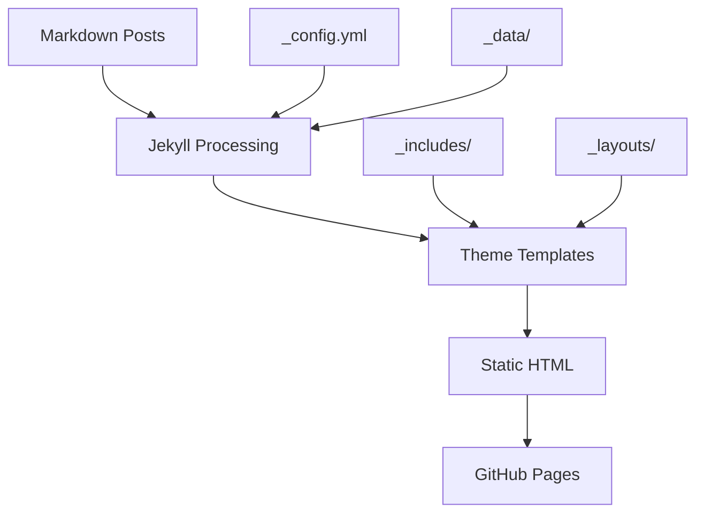

# System Patterns

## Architecture Overview

### Jekyll Static Site Generator
- **Core Framework**: Jekyll 4.x with Ruby ecosystem
- **Theme Base**: Chirpy theme providing professional blog layout
- **Build Process**: Static HTML generation from Markdown content
- **Deployment**: GitHub Pages compatible static files

### File Structure Patterns
```
blog/
├── _config.yml              # Site configuration
├── _data/                   # Site data files
├── _includes/               # Reusable template components
├── _layouts/                # Page layout templates
├── _posts/                  # Blog post content (Markdown)
├── _site/                   # Generated static site (build output)
├── _tabs/                   # Top navigation pages
├── assets/                  # Static assets (CSS, JS, images)
├── uploads/                 # User-uploaded content
└── memory-bank/             # Project documentation and context
```

## Key Technical Decisions

### Content Management
- **Markdown-First**: All content written in Markdown for simplicity and portability
- **Front Matter**: YAML headers in posts for metadata (title, date, categories, tags)
- **Asset Organization**: Images and files organized in logical folder structure
- **Version Control**: Git-based content management with GitHub integration

### Theme and Styling
- **Chirpy Theme**: Professional, responsive Jekyll theme optimized for technical blogs
- **SCSS Architecture**: Modular styling with theme customization capabilities
- **Dark/Light Mode**: Built-in theme switching functionality
- **Mobile-First**: Responsive design patterns throughout

### Performance Patterns
- **Static Generation**: Pre-built HTML for optimal loading speed
- **Asset Optimization**: Compressed CSS/JS and optimized images
- **Caching Strategy**: Browser caching and CDN-friendly structure
- **Progressive Enhancement**: Core functionality works without JavaScript

## Component Relationships

### Content Flow


### Navigation Structure
- **Header Navigation**: Main site sections and search
- **Sidebar Navigation**: Categories, tags, and recent posts
- **Pagination**: Automatic post pagination on index pages
- **Breadcrumbs**: Clear navigation hierarchy

## Design Patterns in Use

### Layout Inheritance
- **Base Layout**: Common HTML structure and head elements
- **Page Layout**: For static pages (About, Contact, etc.)
- **Post Layout**: For blog posts with metadata and navigation
- **Home Layout**: For the main blog index page

### Data-Driven Features
- **Category System**: Automatic categorization and filtering
- **Tag System**: Flexible content tagging and discovery
- **Archive Pages**: Automatic generation of chronological archives
- **RSS/Atom Feeds**: Automated syndication feeds

### SEO and Analytics Patterns
- **Meta Tags**: Automatic generation of SEO-friendly meta tags
- **Structured Data**: JSON-LD markup for rich search results
- **Sitemap Generation**: Automatic XML sitemap creation
- **Analytics Integration**: Google Analytics ready integration

## Development Workflow
1. **Content Creation**: Write posts in Markdown format
2. **Local Testing**: Jekyll serve for local development
3. **Version Control**: Git commit and push to GitHub
4. **Automatic Deployment**: GitHub Pages builds and deploys
5. **Monitoring**: Analytics and performance tracking

## Customization Points
- **Theme Variables**: SCSS variables for colors, fonts, spacing
- **Layout Overrides**: Custom layouts for specific content types
- **Include Partials**: Reusable components for common elements
- **Data Files**: YAML/JSON data for site configuration and content 