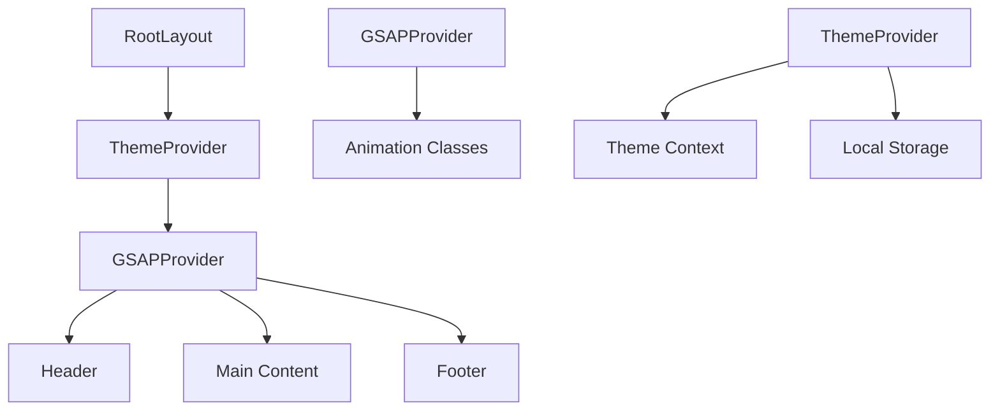
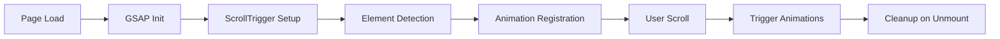

# System Patterns

## Architecture Overview

### Next.js 15 Framework
- **Core Framework**: Next.js 15 with App Router and TypeScript
- **Build System**: Turbopack for fast development and production builds
- **Rendering**: Static Site Generation (SSG) with optional client-side hydration
- **Deployment**: Static export optimized for Yandex Object Storage

### File Structure Patterns
```
blog-nextjs/
├── src/
│   ├── app/                     # Next.js App Router
│   │   ├── globals.css          # Global styles with GSAP classes
│   │   ├── layout.tsx           # Root layout with providers
│   │   ├── page.tsx             # Home page component
│   │   ├── posts/               # Blog post routes
│   │   │   ├── page.tsx         # Posts listing
│   │   │   └── [slug]/          # Dynamic post routes
│   │   ├── search/              # Search functionality
│   │   ├── categories/          # Category pages
│   │   └── tags/                # Tag pages
│   ├── components/              # Reusable components
│   │   ├── ui/                  # Base UI components
│   │   ├── layout/              # Layout components
│   │   ├── animations/          # GSAP animation providers
│   │   └── search/              # Search components
│   ├── lib/                     # Utilities and helpers
│   │   ├── posts.ts             # Post data processing
│   │   ├── search.ts            # Search configuration
│   │   └── utils.ts             # General utilities
│   └── styles/                  # Additional styling
├── content/                     # Markdown blog posts
├── public/                      # Static assets
├── next.config.js               # Next.js configuration
├── tailwind.config.js           # Tailwind CSS configuration
└── tsconfig.json                # TypeScript configuration
```

## Key Technical Decisions

### Animation Architecture
- **GSAP Provider**: Centralized animation management with ScrollTrigger
- **CSS Classes**: Declarative animation triggers (.gsap-fade-in, .gsap-slide-up)
- **Performance**: Hardware acceleration and 60fps optimization
- **Accessibility**: Respect for reduced motion preferences

### State Management
- **React Context**: Theme provider for dark/light mode state
- **Local Storage**: Persistent theme preferences
- **URL State**: Search parameters for shareable search results
- **Component State**: Local state for UI interactions

### Content Processing
- **Gray-matter**: Frontmatter parsing for post metadata
- **Markdown**: Static processing at build time
- **TypeScript**: Type-safe post interfaces and data structures
- **Search Indexing**: Build-time search index generation

## Component Relationships

### Provider Hierarchy


### Animation Flow


## Design Patterns in Use

### Provider Pattern
- **ThemeProvider**: Manages dark/light/system theme state
- **GSAPProvider**: Centralizes animation logic and cleanup
- **Context Distribution**: Efficient state sharing across components

### Component Composition
- **Layout Components**: Header, Footer, Navigation
- **UI Components**: Buttons, Cards, Typography
- **Animation Components**: Wrappers with GSAP classes
- **Page Components**: Route-specific layouts and content

### Data Processing Patterns
- **Build-time Processing**: Markdown compilation and search indexing
- **Static Props**: Pre-computed data for optimal performance
- **Type Safety**: TypeScript interfaces for all data structures
- **Error Boundaries**: Graceful handling of content processing errors

## Animation Patterns

### GSAP Implementation Strategy
```typescript
// Declarative animation classes
.gsap-fade-in     // Opacity: 0 → 1
.gsap-slide-up    // Transform: translateY(30px) → 0
.gsap-scale       // Transform: scale(0.8) → 1
.gsap-slide-down  // Transform: translateY(-30px) → 0
```

### ScrollTrigger Configuration
- **Trigger Points**: Elements animate when 80% visible
- **Performance**: Optimized for mobile devices
- **Reverse Actions**: Animations reverse on scroll up
- **Batch Processing**: Multiple elements animated efficiently

### Theme Transition Animations
- **CSS Transitions**: Smooth color and background changes
- **GSAP Integration**: Enhanced theme switching effects
- **State Persistence**: Theme preference memory across sessions

## Performance Patterns

### Static Generation
- **Build-time Optimization**: All content processed during build
- **Image Optimization**: Next.js Image component with WebP
- **Code Splitting**: Automatic bundle optimization
- **Tree Shaking**: Unused code elimination

### Animation Performance
- **Hardware Acceleration**: GPU-accelerated transforms
- **RAF Optimization**: RequestAnimationFrame for smooth animations
- **Memory Management**: Proper cleanup of ScrollTrigger instances
- **Reduced Motion**: Accessibility-compliant animation disabling

### Loading Strategies
- **Critical CSS**: Above-the-fold styling prioritized
- **Font Loading**: Optimized web font delivery
- **Asset Preloading**: Strategic resource loading
- **Bundle Analysis**: Performance monitoring and optimization

## Development Workflow

### Modern Toolchain
1. **Development**: Next.js dev server with hot reload
2. **Type Checking**: TypeScript compilation and validation
3. **Linting**: ESLint for code quality
4. **Formatting**: Prettier for consistent code style
5. **Building**: Static export for deployment
6. **Testing**: Component and animation testing

### Content Workflow
1. **Creation**: Markdown files with frontmatter
2. **Processing**: Gray-matter parsing and validation
3. **Routing**: Automatic route generation
4. **Optimization**: Image and content optimization
5. **Search Indexing**: Build-time search preparation

## Deployment Patterns

### Static Export Configuration
```javascript
// next.config.js
{
  output: 'export',
  trailingSlash: true,
  distDir: 'dist',
  images: { unoptimized: true }
}
```

### Yandex Object Storage
- **Static Files**: All assets served from CDN
- **Routing**: Client-side routing for SPA behavior
- **Caching**: Optimized cache headers
- **Compression**: Gzip and Brotli compression

## Security Patterns

### Content Security
- **Static Generation**: No server-side vulnerabilities
- **XSS Prevention**: React's built-in protection
- **Content Validation**: TypeScript type checking
- **Asset Integrity**: Hashed file names for cache busting

### Privacy Patterns
- **Local Storage**: Theme preferences only
- **No Tracking**: Privacy-focused analytics approach
- **GDPR Compliance**: Minimal data collection
- **Transparency**: Clear privacy practices

## Scalability Considerations

### Performance Scaling
- **Bundle Size**: Optimized for fast loading
- **Animation Load**: Efficient GSAP usage
- **Content Growth**: Scalable search and navigation
- **Device Support**: Mobile-first responsive design

### Feature Expansion
- **Component Library**: Reusable UI components
- **Plugin Architecture**: Extensible animation system
- **API Integration**: Ready for dynamic content
- **Monitoring**: Performance and error tracking setup 